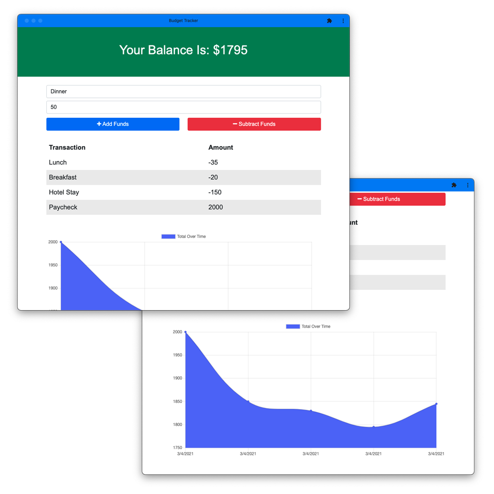

# :zap: 018-PWA-BudgetTracker
A full-stack coding bootcamp, exercise in building a Progressive Web App.

[Live Deploy on Heroku](https://pwa-budget-tracker-018.herokuapp.com/)

# :zap: Description

The goal of this project was to gain familiarity with building an deploying a PWA(Progressive Web App). It uses IndexDB to temporarily store DB data in the case of an interrupted internet connection. it also incorporates the use of a Web Manifest and a Service-Worker, to build the actual PWA and allow the direct installation of the PWA on your phone or desktop. 

# :zap: Functionality

Use of the app is pretty straight forward. Insert a category and monetary amount, then either add or subtract the amount on if it was a payment or an expense. The app uses MongoDB to store data, but is built to also leverage IndexDB so it can temporarily retain functionality in the case the app is offline. When offline, any inputs will be stored in the IndexDB, and once the app gets back online, items stored in the IndexDB will then be pushed to MongoDB. 

To install the app directly, simply "Add to your homescreen" on a phone, or search for the install icon in the URL bar on Chrome
